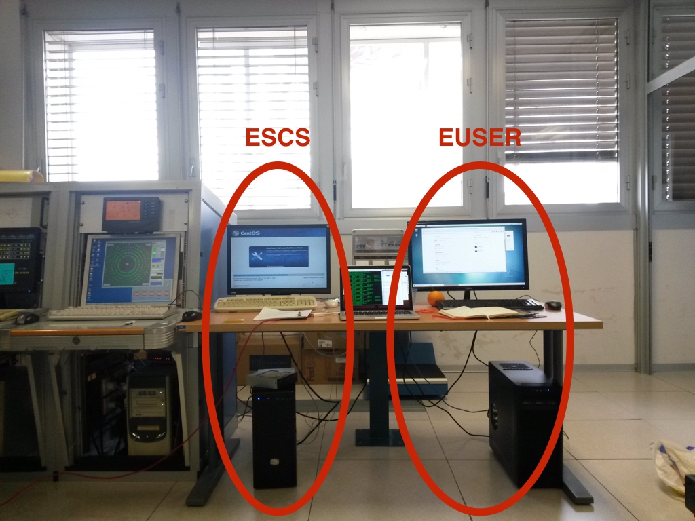

.. _location:

Locations
~~~~~~~~~

All the hardware involved in the ESCS deploy is located in the control
room of the radio telescope. PCs are tower PC with terminals on the table facing the window, 
just next to the AS control panel.

